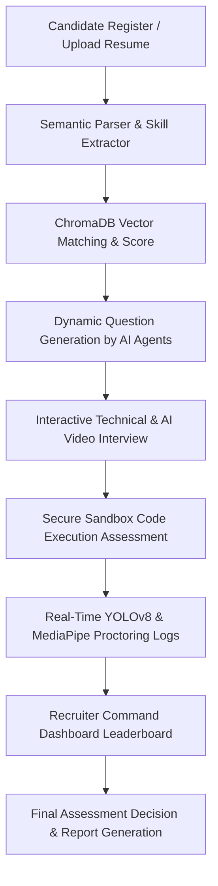
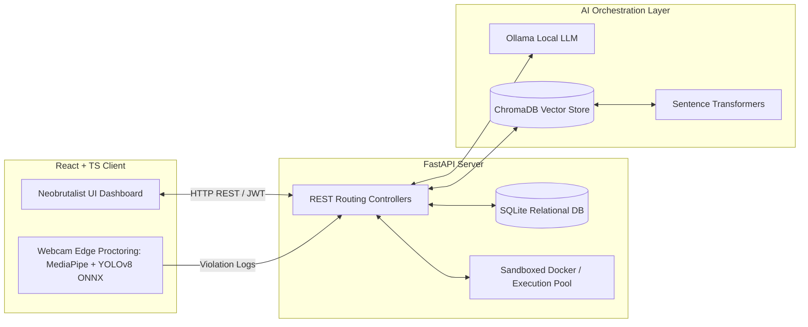
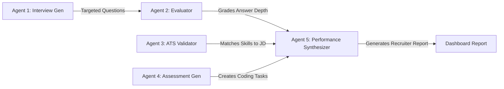

# TalentIQ — AI-Powered Recruitment & Assessment Platform

[](https://react.dev)
[](https://fastapi.tiangolo.com/)
[](https://docs.trychroma.com/)
[](https://ollama.com/)
[](https://opencv.org/)

TalentIQ is an end-to-end intelligent recruitment and assessment SaaS platform designed to streamline, automate, and secure the hiring pipeline. By leveraging a **local AI multi-agent orchestration engine**, **semantic ATS matching**, and **live web-based computer vision proctoring**, TalentIQ eliminates recruitment bottlenecks, removes manual evaluation bias, and secures technical candidate screenings.

---

## 📌 Table of Contents
1. [📖 Problem Statement](#-problem-statement)
2. [💡 Solution Overview](#-solution-overview)
3. [🔄 End-to-End Workflow](#-end-to-end-workflow)
4. [🏗️ System Architecture](#%EF%B8%8F-system-architecture)
5. [🤖 AI Multi-Agent Pipeline](#-ai-multi-agent-pipeline)
6. [🧠 Key Technical Engines](#-key-technical-engines)
   - [Semantic ATS Matching](#semantic-ats-matching)
   - [ChromaDB Vector Store](#chromadb-vector-store)
   - [AI Proctoring Engine](#ai-proctoring-engine)
7. [💻 Tech Stack](#-tech-stack)
8. [📂 Folder Structure](#-folder-structure)
9. [⚙️ Installation Guide](#%EF%B8%8F-installation-guide)
10. [🔗 API Endpoints Overview](#-api-endpoints-overview)
11. [🚀 Future Scope](#-future-scope)
12. [👥 Contributors](#-contributors)

---

## 📖 Problem Statement

Traditional corporate hiring processes face severe operational challenges:
* **Manual Resume Screening:** Recruiter teams spend hours reviewing hundreds of resumes per job post, often missing top-tier candidates due to fatigue.
* **Legacy ATS Matching Limitations:** Traditional ATS tools rely on exact keyword matches. Standard abbreviations (e.g. `React` vs `React.js` or `JS` vs `JavaScript`) result in qualified candidates being auto-rejected.
* **Unstructured & Biased Interviewing:** Interview processes lack structured, dynamic evaluations that directly address individual candidate gaps.
* **Assessment Plagiarism:** Technical code assessments administered online suffer from high cheating rates (copy-pasting, tab switching, and unauthorized device usage).

---

## 💡 Solution Overview

TalentIQ addresses these inefficiencies with an industry-grade, enterprise-ready hiring workflow:
* **Semantic Vector Search:** Cross-encoder matching vectors rank resumes by conceptual experience and raw skill mapping rather than literal word overlap.
* **Collaborative AI Agent Pipeline:** Orchestrates 5 specialized local agents to generate personalized, context-aware interview questions, evaluate code compilations, and validate resume credibility.
* **Real-time Edge Proctoring:** Utilizes local web models (YOLOv8 ONNX + MediaPipe Face Mesh) to monitor head movement, flag secondary persons, detect unauthorized phones, and build a timestamped Integrity Score.
* **Recruiter Command Center:** A beautiful, responsive dashboard highlighting semantic candidate scoring, video proctoring flags, and compiled sandbox results.

---

## 🔄 End-to-End Workflow



---

## 🏗️ System Architecture

TalentIQ is built on a decoupled, secure client-server model optimized to run heavy AI pipelines locally:



---

## 🤖 AI Multi-Agent Pipeline

The core logic of TalentIQ uses a network of **5 specialized autonomous agents** working in sequence to manage, evaluate, and verify the recruitment pipeline:



1. **Agent 1: Question Generator:** Reads the candidate's ATS resume gap report and dynamically formulates questions targeted at validating unverified skills.
2. **Agent 2: Candidate Evaluator:** Grades verbal/written interview answers by semantic relevance and depth, avoiding rigid keyword checking.
3. **Agent 3: ATS Validator:** Cross-checks resume claims against embedding distances and filters out keyword-stuffed claims.
4. **Agent 4: Assessment Generator:** Dynamically creates algorithm exercises based on the job description.
5. **Agent 5: Performance Synthesizer:** Merges interview scores, coding compilation results, and proctoring violation logs into a unified dashboard summary.

---

## 🧠 Key Technical Engines

### Semantic ATS Matching
Legacy ATS tools fail because they scan text literally. TalentIQ uses **Sentence Transformers** to project candidate resumes and job descriptions (JDs) into a high-dimensional vector space. 
We calculate similarity using **Cosine Distance**:

$$\text{Similarity} = \frac{\mathbf{A} \cdot \mathbf{B}}{\|\mathbf{A}\| \|\mathbf{B}\|}$$

This method successfully resolves semantic equivalents:
* `ReactJS` $\leftrightarrow$ `React.js` $\leftrightarrow$ `React Library`
* `Artificial Intelligence` $\leftrightarrow$ `Machine Learning` $\leftrightarrow$ `Deep Learning`

### ChromaDB Vector Store
When a candidate uploads a PDF resume:
1. `PyPDF2` recursively extracts text layers.
2. The document is chunked and embedded via `all-MiniLM-L6-v2`.
3. Vectors are indexed inside a local **ChromaDB** database.
4. The Recruiter can query ChromaDB to search for specific candidate qualifications semantically.

### AI Proctoring Engine
To protect assessment integrity without expensive cloud computing, TalentIQ performs **edge-based vision proctoring**:
* **MediaPipe Face Mesh:** Calculates yaw, pitch, and roll of the candidate's face. If the eyes look away from the browser workspace for more than 3 seconds, a violation is logged.
* **YOLOv8 ONNX:** Tracks frames locally via JS to detect prohibited objects (e.g. `cell phone`, `book`) or the presence of a second person in webcam view.
* **Proctoring Logs:** Send signed REST payloads containing timestamped violations to the backend, computing an overall **Integrity Rating Index (%)**.

---

## 💻 Tech Stack

| Component | Technology | Description |
| :--- | :--- | :--- |
| **Frontend** | React, TypeScript, Tailwind CSS, Vite | Clean, responsive Neobrutalist design with Framer Motion animations. |
| **Backend** | FastAPI (Python) | High-performance asynchronous REST API framework. |
| **Database** | SQLite, SQLAlchemy | Lightweight, ACID-compliant local database. |
| **Vector DB** | ChromaDB | Vector embedding database for semantic queries. |
| **Local LLM** | Ollama (Llama 3 / Mistral) | Locally-run models for cost-efficient content generation and grading. |
| **Vision AI** | OpenCV, MediaPipe, YOLOv8 ONNX | Real-time edge detection and visual monitoring models. |

---

## 📂 Folder Structure

```hl
Talent-IQ/
├── Backend/
│   ├── routers/            # API endpoints (auth, candidate, recruiter, interview)
│   ├── venv/               # Local python environment
│   ├── agent_1_interviewer.py
│   ├── agent_2_evaluator.py
│   ├── agent_3_validator.py
│   ├── agent_4_assessor.py
│   ├── agent_5_interview_evaluator.py
│   ├── code_executor.py    # Sandboxed programming compiler
│   ├── database.py         # SQLAlchemy models and SQLite connection
│   ├── fastapi_app.py      # FastAPI application entrypoint
│   ├── vector_store.py     # ChromaDB wrapper and embeddings
│   └── requirements.txt    # Backend dependencies
└── Frontend/
    ├── src/
    │   ├── components/     # Reusable layout and sketchy components
    │   ├── pages/          # Candidate and Recruiter workspaces
    │   └── App.tsx         # Route orchestrator
    ├── package.json        # Node configurations
    └── tsconfig.app.json
```

---

## ⚙️ Installation Guide

### Prerequisites
* [Node.js](https://nodejs.org/) (v18+)
* [Python 3.10+](https://www.python.org/)
* [Ollama](https://ollama.com/) (installed and running locally)

### 1. Backend Setup
1. Navigate to the backend directory:
   ```bash
   cd Backend
   ```
2. Activate the python virtual environment:
   ```bash
   # Windows:
   .\venv\Scripts\activate
   # macOS/Linux:
   source venv/bin/activate
   ```
3. Install dependencies:
   ```bash
   pip install -r requirements.txt
   ```
4. Start the Ollama model:
   ```bash
   ollama run llama3
   ```
5. Start the FastAPI server:
   ```bash
   python fastapi_app.py
   ```
   The backend server will run at `http://localhost:8000`.

### 2. Frontend Setup
1. Navigate to the frontend directory:
   ```bash
   cd ../Frontend
   ```
2. Install npm dependencies:
   ```bash
   npm install
   ```
3. Run the development build:
   ```bash
   npm run dev
   ```
   The application dashboard will open at `http://localhost:5173`.

---

## 🔗 API Endpoints Overview

| Method | Endpoint | Access | Description |
| :--- | :--- | :--- | :--- |
| **POST** | `/api/auth/signup` | Public | Candidate / Recruiter registration |
| **POST** | `/api/auth/login` | Public | JWT Token generation and verification |
| **POST** | `/api/candidate/upload-resume` | Candidate | Extracts PDF metadata and embeds to ChromaDB |
| **GET** | `/api/candidate/ats-score` | Candidate | Fetches semantic score and missing skills details |
| **POST** | `/api/interview/start` | Candidate | Spawns Agent 1 to generate adaptive tech questions |
| **POST** | `/api/interview/submit-reply` | Candidate | Saves responses and grades them via Agent 2 |
| **POST** | `/api/recruiter/job-post` | Recruiter | Publishes a new job role template |
| **GET** | `/api/recruiter/candidates-pipeline` | Recruiter | Returns ranked pipeline sorted by ATS & Integrity scores |

---

## 🚀 Future Scope

* **Recruiter Workspace Enhancements:** Expanding recruiter dashboards with customizable grading rubrics, automated email triggers, candidate comparison view, and job role templates.
* **Conversational Voice Interviewing:** Integrating real-time Text-to-Speech (TTS) and Speech-to-Text (STT) web interfaces for conversational verbal exams.
* **Advanced Face Mesh Emotion Analytics:** Measuring visual cues (eye contact, confidence indicators) to assess candidate presentation skills.
* **Kubernetes Sandbox Compilers:** Scaling safe local code compilers using containerized microservice architectures.

---

## 👥 Contributors

* **Anika Kaushik** (24CFT0202) — Chitkara University, Punjab
* **Manav Verma** — Chitkara University, Punjab
